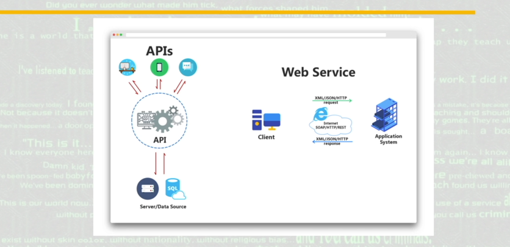
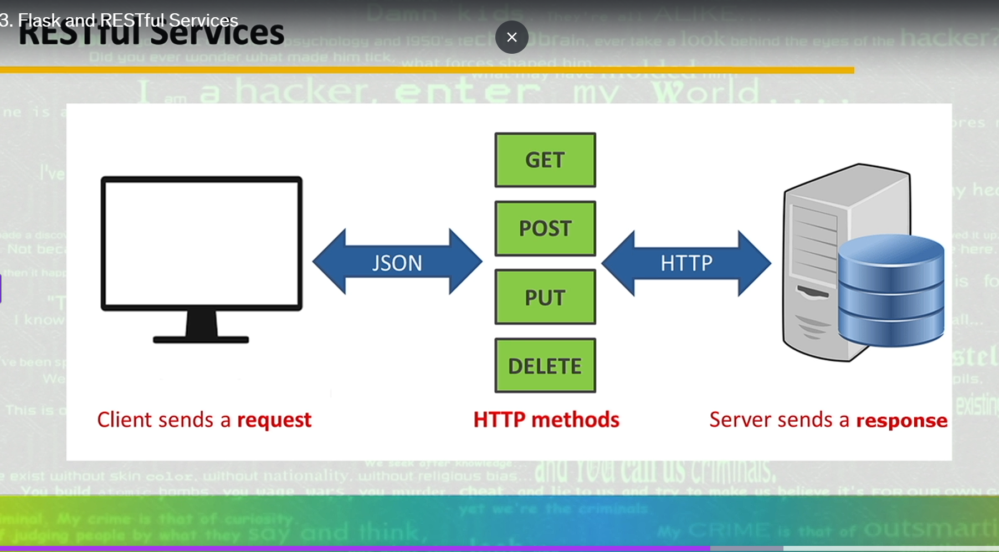
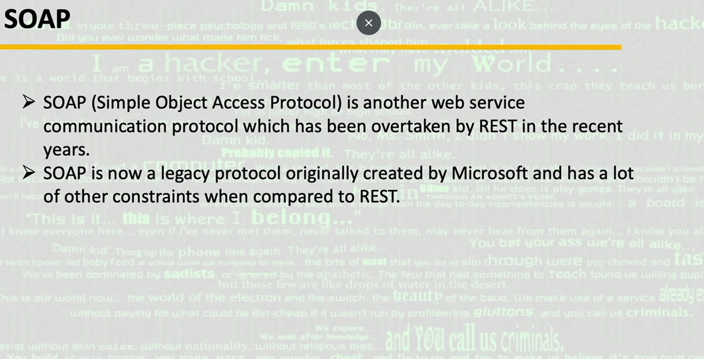
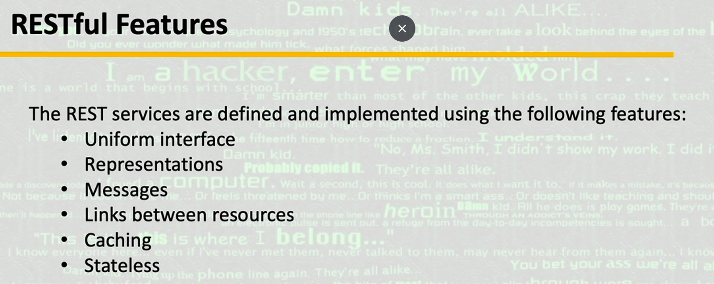
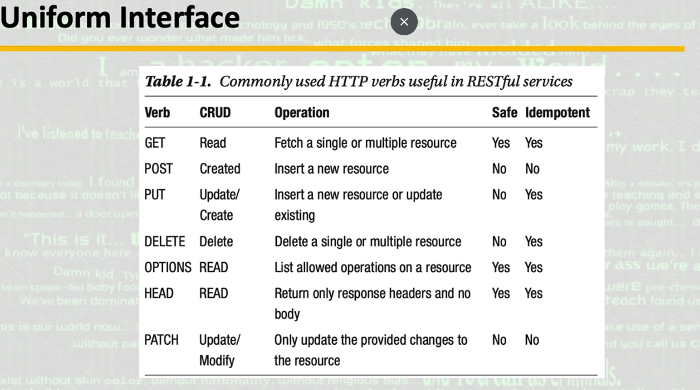

# learn_flask

## Setup Virtual Environment

Install `virtualenv`:

```bash
pip install virtualenv
```

Create a virtual environment:

```bash
virtualenv venv
```

Activate the virtual environment (Windows):

```bash
venv\Scripts\activate.bat
```

## Running the Code

Start the Flask application:

```bash
flask --app app.py run
```

## About Flask

- Flask is a Python package.
- Flask is used to run RESTful services (communication between different devices).

## guide





